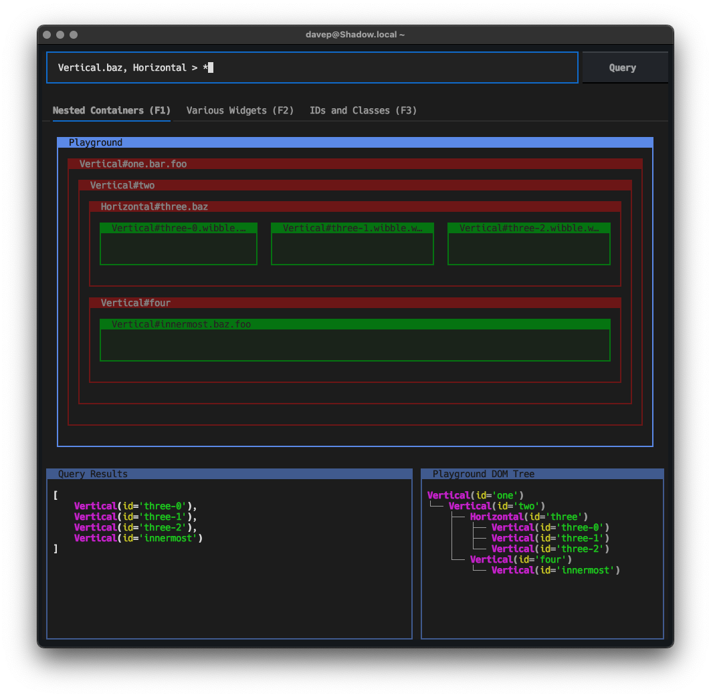

# Textual Query Sandbox

A quick spur-of-the-moment hack that will likely grow into something a wee
bit more useful. For now though, it's a simple/pragmatic tool for quickly
testing [Textual queries](https://textual.textualize.io/guide/queries/).

[//]: # (README.md ends here)
